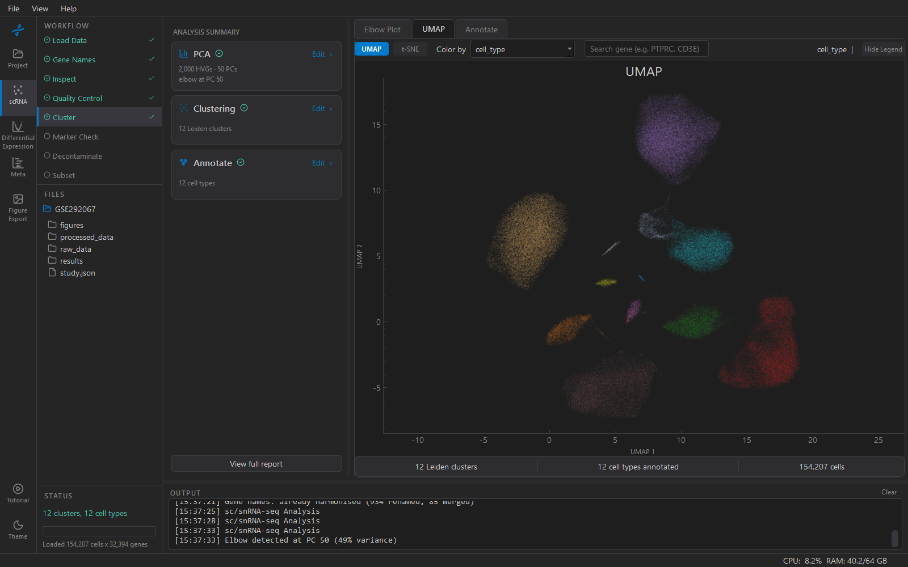

# KOSMIC

[](https://github.com/GoodbyeWilson/kosmic/actions/workflows/ci.yml)
[](LICENSE)
[](https://goodbyewilson.github.io/kosmic/)

**Single-cell and single-nucleus RNA-seq analysis and cross-study
meta-analysis, without code.**

KOSMIC is a desktop application for analysing single-cell and
single-nucleus RNA-seq data. It provides a graphical workflow for
quality control, clustering, cell-type annotation, pseudobulk
differential expression and pathway analysis, using either your own
data or datasets available from public repositories. Results from
multiple independent studies can then be compared by cross-study
meta-analysis to determine whether changes in genes or pathways are
reproducible across studies. Where consistent cell-type annotation is
required, a shared atlas can be constructed across datasets and the
resulting annotations transferred back to the individual studies.
Analysis settings are recorded throughout and can be used to generate
a methods description.



The name stands for *Kirk's Open-source Single-cell Meta-analysis
Integration and Comparison*.

## Key features

- **Complete single-dataset workflow** — import from `.h5ad`, Seurat,
  10x Genomics output, count matrices or directly from GEO; quality
  control, doublet removal, normalisation, clustering, cell-type
  annotation and ambient-RNA decontamination
- **Pseudobulk differential expression** with donors as the unit of
  replication (PyDESeq2), with adjustment for sample-level covariates
- **Hypothesis-driven pathway analysis** — test predefined pathways or
  gene programmes across studies
- **Cross-study meta-analysis** — random-effects pooling of study-level
  results, with rank-based and p-value-combination methods alongside
  and permutation-calibrated significance
- **Consensus and validation** — identify results supported across
  complementary meta-analysis methods, assess leave-one-study-out
  reproducibility, and compare against proteomic panel data
- **Shared atlas** — cluster and annotate several studies together and
  transfer the labels back to each study
- **Publication figures**, and a **methods description** generated from
  the recorded settings
- **No programming required**

## How KOSMIC works

A project represents one biological question. The user adds each
dataset that addresses that question as a study and analyses each study
independently. The resulting study-level results can then be combined
in a meta-analysis.

```
Project
├── Study 1  ─  scRNA Analysis  ─  Differential Expression  ─┐
├── Study 2  ─  scRNA Analysis  ─  Differential Expression  ─┼─  Meta-Analysis  ─  Figures
└── Study 3  ─  scRNA Analysis  ─  Differential Expression  ─┘
```

The **Project** workspace is used to manage the studies: adding them,
importing their data, and reviewing how far each has progressed.
**scRNA Analysis** takes one study from an expression matrix to
annotated cell populations, and can create a new study containing a
cell type of interest for downstream analysis. **Differential
Expression** compares two conditions within a cell type for one study.
**Meta-Analysis** combines those results across studies. **Figures**
exports figures from any of them.

Studies are kept separate deliberately. A meta-analysis asks whether
independent studies agree; merging their cells into one experiment
would throw that question away. Where consistent cell-type annotation
across datasets is needed, a shared atlas can instead be built from the
studies, annotated once, and the labels transferred back to each study.

## Analysis modes

- **Hypothesis mode** — test a predefined pathway or gene programme in
  each study, combine the pathway-level evidence across studies, and
  identify the genes contributing to the signal.
- **Discovery mode** — genome-wide meta-analysis to find the genes that
  are consistently differentially expressed in a cell type across
  studies, followed by enrichment analysis of the pooled result.
- **Methods comparison** — run every pooling method on the same studies
  and compare their behaviour and reproducibility by leave-one-study-out
  replication.

The statistical reasoning behind the defaults is set out in the
documentation's [Statistical approach](https://goodbyewilson.github.io/kosmic/meta/statistics/).

## Getting started

**Installer.** One-click installers for Windows, macOS and Linux will be
published on the Releases page. Until the first release, install from
source.

**From source** — Python 3.11 or newer and Git are the prerequisites:

```sh
git clone https://github.com/GoodbyeWilson/kosmic.git
cd kosmic
python -m venv .venv
.venv\Scripts\activate          # Windows;  macOS/Linux: source .venv/bin/activate
pip install -e .
python main.py
```

The step-by-step version, including installing Python, R for Seurat
files, and the optional extras, is in the
[installation guide](https://goodbyewilson.github.io/kosmic/install/).

## Documentation

The [user documentation](https://goodbyewilson.github.io/kosmic/) covers the complete workflow, from
project setup and single-dataset analysis through differential
expression, meta-analysis and figure export. The same pages are
available from within KOSMIC by pressing **F1**.

Developer documentation: [CONTRIBUTING.md](CONTRIBUTING.md) covers
development setup and conventions; [CODEBASE.md](CODEBASE.md) describes
the architecture; the [developer reference](https://goodbyewilson.github.io/kosmic/reference/) is
generated from the source documentation.

## Citation

A methods paper is in preparation. Until it is published, please cite
this repository.

## Licence

KOSMIC is released under the [GNU General Public License v3.0](LICENSE).
See [NOTICE.md](NOTICE.md) for the licences and terms associated with
the bundled reference data, including resources subject to additional
restrictions on use.

## Authors

- **Calum Wilson** — University of Strathclyde
- **Kirk Franks** — University of Strathclyde
