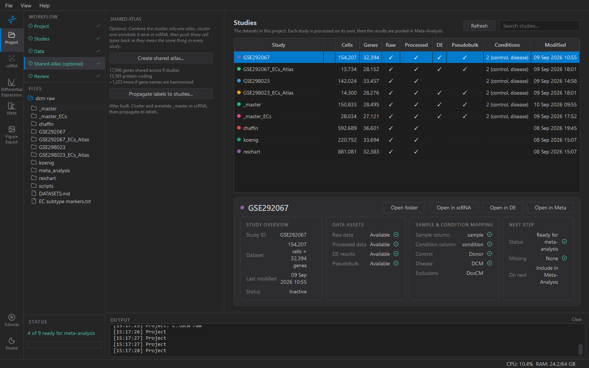

# 4. Shared atlas (optional)

Combining the studies into one **shared atlas** lets you define cell
types once, across all of them, and then push those labels back onto
each study. That matters because per-cell-type differential expression
is only comparable between studies if "cardiomyocyte" means the same
thing in each one.

The atlas is a study like any other, in `_master/`, and opens in the
scRNA workspace the same way. It is optional: if every study is already
annotated to a scheme you trust, skip this step. Review does not depend
on it.



## The sequence

```
1. Prepare each study      Data → scRNA: Gene Names, Inspect (roles), QC
2. Create shared atlas     this step
3. Cluster the atlas       scRNA → Cluster, with Harmony on 'study'
4. Annotate the atlas      scRNA → Cluster / Marker Check
5. Propagate labels        this step
```

Steps 1 and 2 are the ones to be careful about; the rest is ordinary
processing that happens to be running on a bigger object.

## 1. Prepare each study first

Combining reads each study's **processed** h5ad, not the original
download. Whatever state a study is in is what goes into the atlas, so
anything you skip is skipped for good.

**Harmonise gene names before combining.** The atlas is an *inner join*
on gene names: a gene missing from any one study is dropped from all of
them. A study still using an older annotation build shares far fewer
genes than it should, and the loss is silent — you just get a narrower
atlas. The sidebar shows the shared-gene count before you commit, and
how many more you would get by harmonising.

**Set roles before combining**, so off-target arms can be left out.

## 2. Create shared atlas

**Create shared atlas…** opens the Combine dialog. Tick the studies to
include. Every condition value needs a role, or the dialog will say
which are unmapped.

- **Leave out cells marked 'exclude'** (on by default) skips arms you
  have ruled out. They are often a large fraction of a study — across
  two DCM studies, the doxorubicin and ischaemic arms are about half the
  cells — and they never enter a contrast, so carrying them into the
  atlas means clustering, annotating and storing them for nothing. The
  source studies are untouched either way.
- **Drop genes merged inconsistently across studies** (on by default)
  removes genes that harmonisation built from two source columns in one
  study and one in another. The count is usually small; the effect is a
  per-study offset that inflates heterogeneity.
- **Cell cap** — subsample each study to a fixed number of cells to
  keep the atlas tractable, or **Use all cells**. A cap affects how
  labels come back in step 5.

Cells are named `<barcode>-<accession>` in the atlas, and an
`obs['study']` column records which study each came from.

## 3. Cluster the atlas

**Harmony matters here in a way it does not for a single study.** Set
the batch key to `study`. Without it your clusters will substantially
*be* the studies, and the cell types you propagate would encode which
paper a cell came from.

Check the result by colouring the UMAP by `study`: each cell type should
contain cells from every study, intermixed. Islands that are one study
only mean the correction has not worked.

## 4. Annotate the atlas

As for any dataset. The Marker Check step exists to sense-check the
result before you propagate it — labels you push out are hard to take
back.

## 5. Propagate labels

**Propagate labels to studies…** becomes available once the atlas
exists. Labels land in each study as **`cell_type_atlas`** and
**`leiden_atlas`**. Each study keeps its own `cell_type` and `leiden`
from when it was processed alone, so you can compare the two. A study
that was never annotated individually also gets a plain `cell_type`,
since there is nothing to protect.

Only studies actually in the atlas are offered — the atlas's own
`study` column decides, not what happens to be in the project folder.

Matching is by cell barcode, which is fast and exact. Two cases give
partial coverage:

- **Cells were excluded.** Those cells are not in the atlas by design,
  so they are joined where possible and left unlabelled otherwise.
- **A cell cap was used.** The absent cells are an arbitrary subsample,
  so labels are projected by nearest neighbours in the atlas's PCA space
  instead. This is slower and needs the atlas to have PCA computed.

## Independent labels vs atlas labels

Keeping both is the point. Per-study annotation and atlas annotation
are two different analyses:

- **Independent** — each study annotated alone. What you would have
  without the atlas.
- **Atlas** — one clustering across all studies. Consistent by
  construction, but shaped by the batch correction that made it
  possible.

Agreement between them is a result worth reporting. Disagreement is
worth understanding before you build on either.

## Things that catch people out

- **Combining does not filter cells by QC.** It takes each study as it
  stands; QC belongs in step 1.
- **The atlas's `.X` is raw counts.** Combining promotes `.raw` so the
  atlas can be normalised and clustered from scratch.
- **Re-creating the atlas overwrites it.** Any clustering or annotation
  on it is lost; the source studies are unaffected.
- **An atlas is not a substitute for per-study DE.** It gives you shared
  labels. Differential expression still runs per study on raw counts,
  which is what keeps a meta-analysis a meta-analysis.
