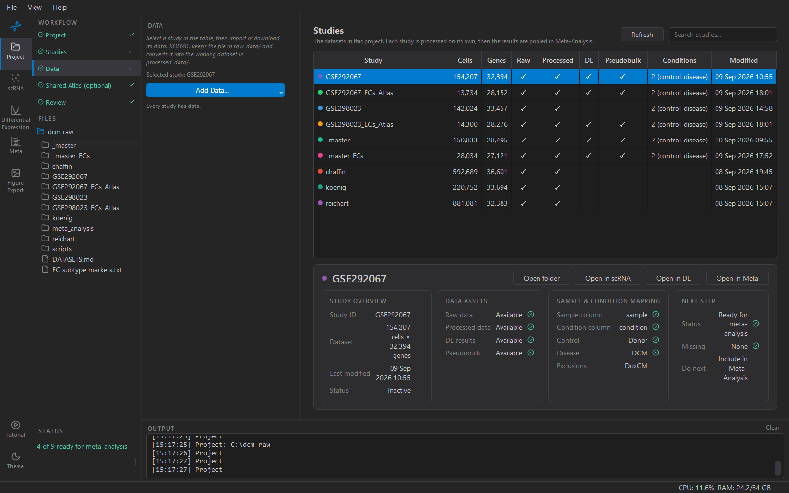

# 3. Data

Gets data into the study you have selected in the table. Whatever route
you pick, the result is the same: the file lands in the study's
`raw_data/`, KOSMIC converts it, and the working dataset appears in
`processed_data/`. You do not need to visit another screen to finish.

## The routes

**Add Data…** offers five:

| Menu item | Use it for |
|---|---|
| **Import h5ad…** | An `.h5ad` you already have — from CellxGene, Single Cell Portal, a collaborator |
| **Import Seurat RDS / Robj…** | `.rds`, `.Robj`, or their `.gz` forms. Needs R with Seurat installed |
| **Import CSV / TSV…** | A count matrix as text (gzip accepted) |
| **Download from GEO…** | Fetch a GEO series by accession |
| **Assemble from parts…** | Build from a matrix + features + barcodes triplet |

The sidebar lists which studies still have no data, so with several
studies you can work down the list.



## Raw counts, and why KOSMIC is fussy about them

Pseudobulk differential expression is a count model. Give it
log-normalised values and it produces no error — just wrong answers. So
the one thing the import insists on is a matrix of **raw integer
counts**.

An h5ad can hold the same cells' expression more than once — in `X`, in
any number of `layers`, and in `.raw` — and which slot has the counts
depends on who deposited it:

- **CellxGene** normalises `X` and keeps counts in `.raw`.
- **Single Cell Portal** deposits sometimes hold ambient-corrected
  counts in `X` and the uncorrected ones in a layer.
- **Seurat exports** usually have counts in `X` alone.

On import KOSMIC inspects every matrix in the file and reports what it
found:

```
X:      log-normalised (max 7.8)
raw.X:  raw counts (max 3,172.0)
X is not raw counts — using raw.X instead
```

Three outcomes:

- **One matrix of raw counts** — it is used, and the log says which.
- **More than one** — you are asked which to analyse. The dialog says
  how they differ (one usually has fewer stored values, meaning
  something has been removed: ambient correction or extra filtering).
  Which is which is the depositor's business — check their README. Your
  choice, and the options rejected, go into the study's provenance.
- **None** — the import stops. A file with no raw counts cannot support
  DE, and it is better to find that out now than after clustering.

## Seurat files

KOSMIC exports the RNA assay's `counts` slot by running R as a separate
process, then assembles the h5ad — so a normalised or `SCT` assay is not
picked up by mistake. R and the Seurat package have to be installed;
KOSMIC finds R on `PATH` or under `C:\Program Files\R`. Large objects
take a while; progress appears in the output panel.

`.Robj` files from GEO are sometimes double-compressed (GEO gzips a file
R had already compressed). That is handled.

## After importing

The table fills in Cells and Genes and ticks **Processed**. The dataset
is not yet ready to analyse — it still needs gene names harmonised,
sample and condition columns identified, and QC. The details panel's
**Next step** says *Open in scRNA*; do that.

## Several studies

Import each separately, then keep the downstream choices the same
across all of them — the same QC rule, the same annotation reference,
the same cell-type level. Where studies differ in how they were
prepared, that difference shows up later as between-study heterogeneity
and can be mistaken for biology.
