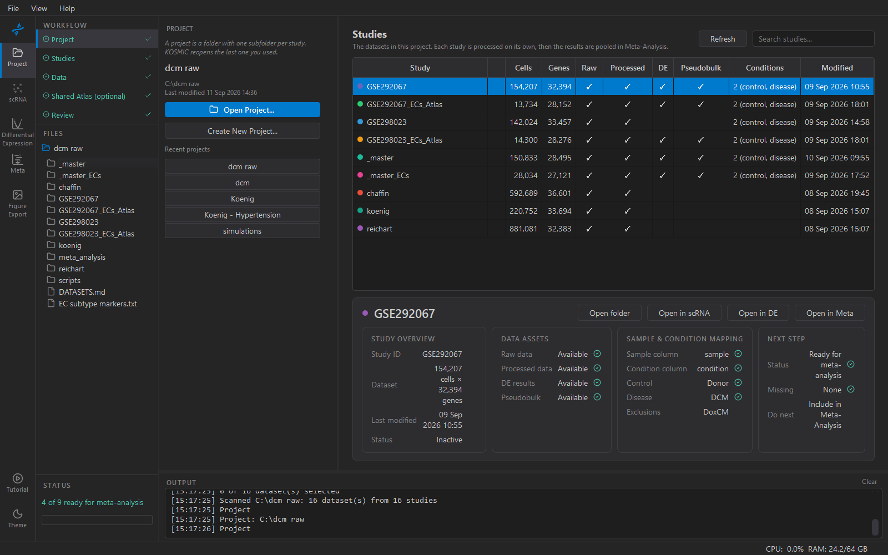

# 1. Project folder

A project is a folder. Everything KOSMIC produces for an analysis lives
under it, one subfolder per study, so the folder is the whole record —
copy it and you have copied the project.

## Open, create, switch

- **Open Project…** — pick an existing project folder.
- **Create New Project…** — pick a parent folder and a name. KOSMIC
  makes the folder and a `meta_analysis/` subfolder inside it. Nothing
  else is created until you add studies.
- **Recent projects** — one click reopens a project you have used
  before. The same list is on the welcome screen when nothing is open.

KOSMIC reopens the last project automatically when it starts, so this
step is normally already ticked. Come back here to switch projects; the
current folder and when it last changed are shown at the top of the
sidebar.

## What is safe to touch

The folder is yours. Things that are fine to do in a file manager:

- Copy or move the whole project. Paths inside it are relative.
- Delete a study folder you no longer want (or use *Remove selected
  study…* in step 2, which does the same thing).
- Look at anything in `results/` — the CSVs and figures are meant to be
  opened.

Things to avoid:

- **Renaming a study folder.** The folder name is the study's accession,
  and the files inside are named after it.
- **Editing files in `processed_data/`.** The working h5ad and its
  `provenance.json` record every setting used to make it; the Methods
  step reads that record.
- **Putting your own folders at the top level.** A top-level folder
  that contains a `raw_data/`, `processed_data/` or `results/`
  subfolder is treated as a study. Plain folders of notes are
  ignored, but a copy of a study is not.

## On a shared drive

A project on a network drive works, but the h5ad files are large and
every workspace reads them in full. Copy the project locally for
analysis and back to the share when you are done.
