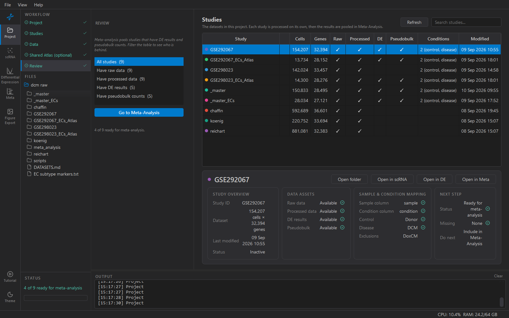
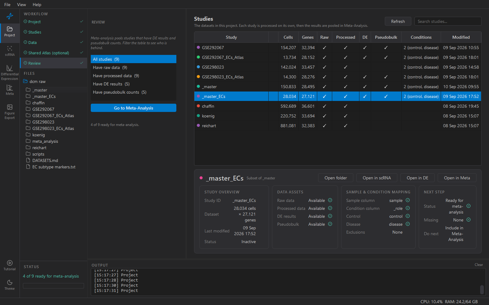

# 5. Review

Meta-analysis pools studies that have **DE results** and **pseudobulk
counts**. This step is where you check who has them, and send the ones
that do to Meta-Analysis.

## The table as a progress view

Each row's ticks say what exists on disk for that study:

| Column | Meaning |
|---|---|
| Raw | something in `raw_data/` |
| Processed | a working h5ad in `processed_data/` |
| DE | a differential-expression table in `results/de_analysis/` |
| Pseudobulk | the per-sample count matrix DE was run on |
| Conditions | the roles you assigned in Inspect — `2 (control, disease)` |
| Modified | last change to the study folder |

Reading left to right, a row tells you where a study stopped. Raw but
not Processed: the import did not finish. Processed with no Conditions:
Inspect has not been done. Processed and Conditions but no DE: it is
ready for the Differential Expression workspace.

The sidebar filters — *Have raw data*, *Have processed data*, *Have DE
results*, *Have pseudobulk counts* — show one of those groups at a time,
with counts. They are filters, not steps: *Have DE results (5)* means
five rows, and nothing happens when you click it except the table
narrowing.

## The Next step card

Select a row and the details panel says what it needs, in order:

| Status | Do next |
|---|---|
| No data | Add Data (step 3) |
| Raw only | Open in scRNA → Load Data, to convert |
| Not configured | Open in scRNA → Inspect: set sample, condition and roles |
| Processed | Open in DE and run differential expression |
| Ready for meta-analysis | Include in Meta-Analysis |

The shared atlas is never "ready": it exists to be annotated, not
pooled.

## Subsets are what usually gets pooled

A full study's DE result is genome-wide across all its cells. What a
meta-analysis usually wants is DE *within one cell type* — endothelial
cells in each study, say — and that is what the scRNA **Subset** step
produces: a new study (`GSE183852_ECs`) with its own DE results. Those
subset rows are what will tick here, and what Meta-Analysis will offer.
The parent studies can sit at Processed indefinitely; that is normal.

## Go to Meta-Analysis

Enabled once two or more rows are ready. It opens the Meta-Analysis
workspace on this project; Select Studies there offers every study with
DE results, and you choose which to pool.

The explorer's STATUS line at the bottom left says the same thing in
one line — `4 of 9 ready for meta-analysis` — from whichever step you
are on.
