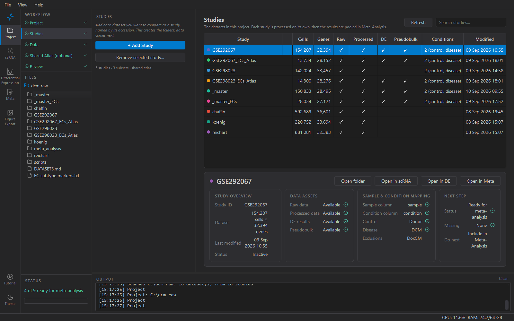

# 2. Studies

A study is one published dataset. This step creates a folder for each
one; the data comes in the next step.

## Adding studies

**+ Add Study** asks for accession IDs — paste several at once, one per
line or separated by commas. Each becomes a folder with the standard
layout (`raw_data/`, `processed_data/`, `results/`) and appears as a
row in the table with nothing ticked.

Name studies by their public accession where one exists (`GSE183852`,
`SCP1303`). The name is used for the folder, for every file inside it,
and as the study label in every figure and table downstream, including
the meta-analysis forest plots — so it should be something a reader of
your paper can look up.

Adding a study fetches nothing. It is a promise that data will follow.

## Two is the floor

A meta-analysis pools studies, so the step is ticked at two. In
practice more is better: with two studies the random-effects model
cannot estimate heterogeneity well, and every pooling method behaves
the same. Five or more is where the method choice starts to matter.

## Removing a study

**Remove selected study…** deletes the study folder and everything in
it — data, results, figures. KOSMIC asks first; there is no undo. If
you might want it back, move the folder out of the project instead.

## The count

The sidebar says what the project holds: `5 studies · 3 subsets ·
shared atlas`. Only studies count towards the floor. Subsets and the
atlas are made by later steps and do not need adding.
