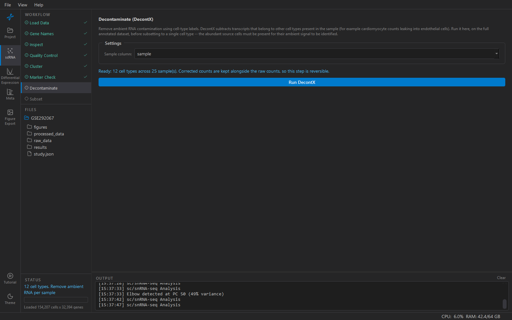

# Decontaminate (optional)

Removes **ambient RNA** — transcripts that were floating free in the
dissociation and got counted in every droplet regardless of what cell
was in it. In tissue with one dominant, RNA-rich cell type this matters
a great deal: in heart, every endothelial cell "expresses" a little
`TTN` and `MYH7`, because the soup does. Left in, that shows up later as
differential expression in the wrong cell type whenever the disease
changes the dominant type's output.

The method is **DecontX**: for each cell, transcripts that do not fit
its own cell type's profile are attributed to the other cell types
present and subtracted. That sentence explains everything about where
the step sits.

## Why it is here and not earlier

DecontX needs to *know the cell types* — that is what it attributes the
off-profile counts to — so it runs after annotation. And it needs the
**source cells present**: to recognise cardiomyocyte RNA in an
endothelial cell, the cardiomyocytes have to be in the dataset. Run it
on an endothelial-only subset and there is nothing to attribute to; it
removes nothing useful.

So: after Cluster and Marker Check, before Subset. Three gates enforce
that, and the Run button is disabled with the reason if one fails:

1. cell-type labels exist (`cell_type` is annotated),
2. at least two cell types are present (the dataset is not already a
   subset),
3. a sample column is set in Inspect — ambient RNA is generated during
   *each sample's* dissociation, so decontamination is per sample.

## Running it

**Sample column** is pre-filled from Inspect. **Run DecontX** works
through the samples one at a time; progress shows which. Peak memory is
one sample's worth, so a 150,000-nucleus dataset is fine on a
workstation.

Decontaminated counts go to **`layers['decontX_counts']`**. The
original counts in `X` and `.raw` are **never overwritten**, so the step
is reversible and you can run DE on either and compare — which is worth
doing at least once, to see how much the soup was contributing.

## Downstream

- **Subset** carries the layer into the new study automatically.
- **Differential Expression** has a *Count source* setting: *Raw
  counts* or *Decontaminated (DecontX)*. The second is offered only when
  the layer exists.
- The choice is recorded in provenance either way, so Methods will say
  which counts each result came from.

## When to skip it

Whole-cell data from a tissue without a dominant type, or nuclei that
were FANS-sorted, usually has little soup to remove; look at the
*Contam. panel* score from QC in DE's spillover diagnostic first. If
the panel score is flat across conditions, decontamination will not
change your answer.

This step needs the `decontx` package, which is an optional extra —
see the install notes. Without it the step says so and can be skipped.
