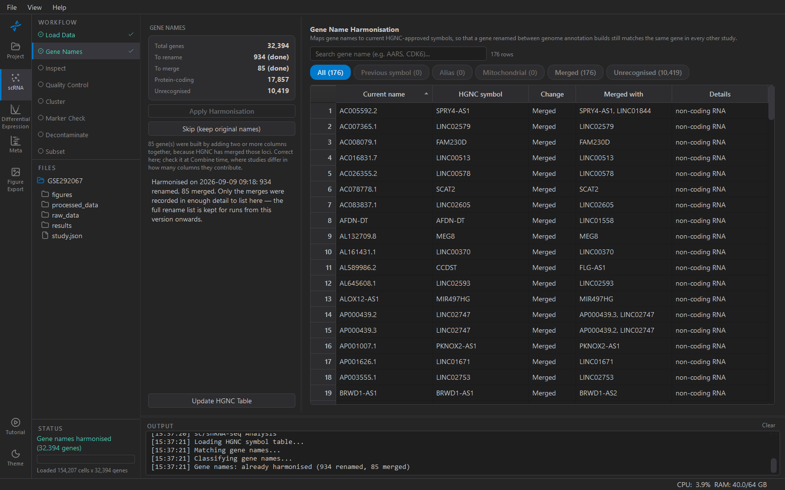

# Gene Names

Renames the dataset's genes to their current **HGNC-approved symbols**.
Nothing else in KOSMIC needs this for one study; the meta-analysis needs
it absolutely.

## Why

Two studies deposited three years apart used different genome
annotations, and the same gene has different names in each — `FAM19A5`
in one, `TAFA5` in the other; `C10orf54` and `VSIR`; `MLLT4` and
`AFDN`. When KOSMIC pools per-gene results across studies it matches
genes *by name*, so an un-renamed gene simply drops out of the join.
The shared-gene count on the Project page's Shared Atlas step shows how
much this costs: a study on an older build can share barely two thirds
of its genes with the others until it is harmonised.

The renaming uses HGNC's own tables, which record for every current
symbol the *previous symbols* it replaced and the *aliases* it is known
by.

## What the run proposes

Open the step and KOSMIC scans the dataset against the table and shows
what it would change, without changing anything yet. The sidebar
summarises:

| Row | Meaning |
|---|---|
| Total genes | genes in the dataset |
| To rename | genes whose name would change |
| To merge | current symbols that two or more old names map to — their counts are added together |
| Protein-coding | how many genes HGNC classes as protein-coding, *after* the run |
| Unrecognised | names HGNC has never heard of, *after* the run |

The table lists every proposed change with its reason. Filter it with
the chips:

- **Previous symbol** — HGNC's most authoritative mapping: the old name
  was formally retired in favour of the new one. Safe.
- **Alias** — a looser mapping. Worth reading before you accept.
- **Mitochondrial** — legacy mtDNA names (`ND1`, `CYTB`, `COX1`) mapped
  explicitly to `MT-ND1`, `MT-CYB`, `MT-CO1`. These are handled
  separately because several collide with unrelated nuclear genes in
  the HGNC alias table — `ND1` is also an alias of `IVNS1ABP` — and in
  single-cell data they are always the mitochondrial gene.
- **Merged** — columns whose counts are summed because HGNC has merged
  the loci. Usually a handful.
- **Unrecognised** — retired clone-based names, bare Ensembl IDs.
  Nothing is renamed; they are listed because they match nothing in
  another study either.

## The ambiguity rule

An old name that two current genes both claim is **never renamed**.
Remapping it would silently move counts to the wrong gene. This is why
some obvious-looking renames are absent from the list; they are
ambiguous in HGNC, and KOSMIC leaves them alone rather than guess.

## Apply, or skip

**Apply Harmonisation** renames in place, sums merged columns, and
saves the h5ad. The change is recorded in the study's provenance, so
Methods will say it was done and how many genes it touched.

**Skip (keep original names)** marks the step done without changing
anything. Do this only if every study in the project is already on the
same annotation build — otherwise you are choosing a smaller
meta-analysis.

**Update HGNC Table** downloads the current table from genenames.org.
The bundled one is fine for most work; update it if a study is newer
than KOSMIC's copy.

## Human only

The HGNC table is human. A mouse dataset can pass through this step
unchanged (skip it) — mouse symbols need a different reference and are
not renamed here.
