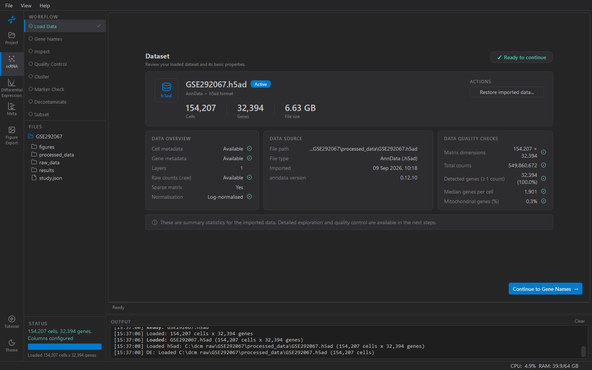

# Load Data

Shows the study's working dataset and its basic properties. Getting
data *into* a study happens on the Project page ([Data](../project/data.md));
this step is where you look at what arrived and confirm it is what you
think it is.

When you open a study in this workspace, KOSMIC loads its working h5ad
in the background. The hero card says *Loading…* until it is in; then
the panels fill. A study activated while another workspace is in front
(from the Project page, or from the study selector in Differential
Expression) is not loaded here until you open this workspace, so only
one dataset is held in memory at a time.

## Reading the panels

**Data overview** — what the file contains. *Cell metadata* and *Gene
metadata* are the `obs` and `var` tables; *Layers* counts extra
matrices; *Raw counts (.raw)* says whether a counts snapshot exists;
*Normalisation* says whether the main matrix looks like counts or
log-normalised values.

**Data source** — the file path, its format, when it was imported, and
the anndata version that wrote it.

**Data quality checks** — dimensions, total counts, how many genes are
detected at all, median genes per cell, and the mitochondrial fraction.
These are the numbers to compare against the paper's methods section: a
median of 400 genes per cell where the paper reports 1,900 means you
have the wrong matrix or the wrong file.

> **Note:** A processed h5ad from a repository has usually already been
> filtered by its authors. Cells and genes here are what *they* kept.
> QC in KOSMIC filters further; it does not restore anything.

## What you might see instead

- **A raw import waiting to be converted.** If the study's `raw_data/`
  holds something that is not yet an h5ad — a 10x `matrix.mtx` folder,
  a 10x `.h5`, a text matrix, a tarball of per-sample archives — the
  page names the format and offers **Convert to h5ad**. The conversion
  runs in the background and the result becomes the working dataset.
  Imports made from the Project page do this automatically; this
  button is for files that were dropped into `raw_data/` by hand.
- **No data registered.** Nothing in `raw_data/` or `processed_data/`.
  Go to Project → Data.

## Other datasets

If `processed_data/` holds more than one h5ad — an older version, or a
file you copied in — they are listed under *Other datasets* and you can
switch to one. The newest file is loaded by default.

## Restore imported data…

Copies the originally imported file back as the working dataset,
discarding QC, clustering and annotation. It is the way back if a QC
cut turned out too aggressive. It asks first; the imported file itself
is never modified.

## Continue

**Continue to Gene Names →** appears once the dataset is loaded. The
step is complete when a working h5ad exists.
