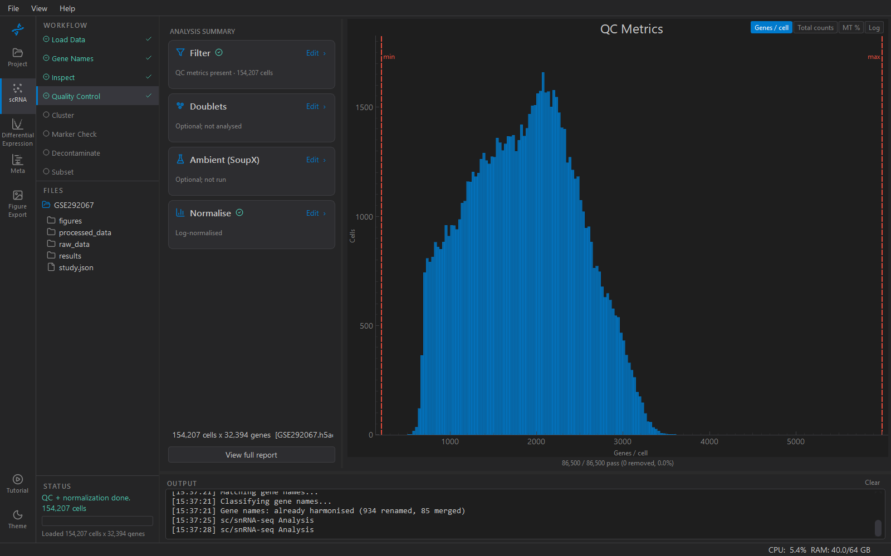

# Quality Control

Four stages, left to right in the sidebar: **Filter** low-quality
cells, remove **Doublets**, optionally subtract **Ambient** RNA, then
**Normalise**. Each stage's card shows what it did once it has run, and
*View full report* gives the numbers in one place.

The plot on the right is the thing to look at before you touch a
number. It is a histogram of one QC metric per cell — genes per cell,
total counts, or mitochondrial % — with the current thresholds drawn as
lines you can drag. **Log** switches the x-axis to log scale, which is
where count data reads properly.

## Filter

Cells are removed, in this order: fewer than *Min genes* or more than
*Max genes*; fewer than *Min counts* or more than *Max counts*; then,
only if *Min cells / gene* is set, genes seen in fewer cells than that
are dropped; then cells over *Max MT %* on the recomputed metrics. The original counts are kept in
`layers['counts']` before anything is removed.

| Setting | Default | What it catches |
|---|---|---|
| Min genes | 200 | empty droplets, debris |
| Max genes | 6,000 | likely doublets; 0 = off |
| Min / Max counts | 0 (off) | the same, by depth; use when genes-per-cell is uninformative |
| Max MT % | 20 | dying cells with leaky membranes |
| Min cells / gene | 0 (off) | genes detected in almost no cells. Off because a gene seen in two of 600,000 nuclei is a measured near-zero, never an HVG, and the DE gene filter sets it aside per run; dropping it here gives each study its own gene list, which shrinks the genes the atlas and the meta-analysis have in common |

A max bound of 0 is off, in the filter and in the histogram's
pass/removed preview alike. Think before capping genes or counts in a
tissue where one cell type carries far more transcripts than the rest —
cardiomyocyte nuclei in heart — because the cap removes that type, not
doublets. Scrublet (below) is the doublet filter.

On a deposited dataset the authors have already filtered, set the floors
at or below theirs and the caps off, so this step removes nothing but
creates the counts layer and normalises; the number removed is reported
and recorded, and should be near zero. The number of genes kept is
reported beside the cells, so a change to the gene list is never silent.

Two ways to set them:

- **Fixed thresholds** — type the numbers. The defaults are the common
  ones for whole-cell 10x data.
- **MAD-based** — KOSMIC pre-fills each box from the data: median ± *n*
  median absolute deviations, computed on log1p values because count
  distributions are right-skewed. 5 MADs is standard, 3 is aggressive.
  The boxes are still editable afterwards; MAD is a starting point, not
  a rule.

> **Note:** Single-nucleus data has almost no mitochondrial reads —
> nuclei have no mitochondria — so a 20% cut removes nothing and a 5%
> cut is the meaningful one. Look at the histogram; the tail is either
> there or it is not.

**Contam. panel** — optional. Scores each cell for a panel of genes
specific to the tissue's dominant, RNA-rich cell type (cardiomyocyte
genes in heart) and stores it as `pct_counts_<panel>` in `obs`. It
does not filter anything here; it is carried into DE, where it
separates real differential expression from ambient spillover. Pick the
panel for your tissue, or *None*.

**Apply QC Filters** does the filtering and saves. The card reports
cells before and after.

## Doublets

**Run Scrublet** simulates doublets from the data and scores every cell
by similarity to them. *Rate* is the expected doublet fraction — 6% by
default, typically 5–10% and roughly 0.8% per 1,000 cells loaded in a
10x lane. *Min counts* is the gene floor for the simulation. Scrublet
picks a threshold on the score distribution automatically; where that
fails on a small or unusual dataset, KOSMIC falls back to a percentile
matching the expected rate and says so.

The plot switches to the doublet-score histogram with the threshold
marked. **Filter Doublets** removes cells above it. Scores and calls
stay in `obs` (`doublet_score`, `predicted_doublet`) either way.

## Ambient (SoupX)

Optional, and unusual to need here — most ambient-RNA handling in KOSMIC
happens after annotation in the [Decontaminate](decontx.md) step, which
knows the cell types. SoupX at this stage is for datasets that arrive
with an obvious soup problem before clustering.

*Auto-estimate* derives the contamination fraction from cluster
markers; *Manual fraction* applies a fixed one (0.05–0.20 is typical).
The subtraction is the standard SoupX method, reimplemented so it runs
in seconds rather than half an hour on a large dataset. It needs the
raw 10x output to estimate the soup profile — **Browse…** to point at
it.

## Normalise

**Normalize & Save** rescales every cell to *Target sum* total counts
(10,000, the scanpy convention) and applies log(1 + x). Before it does,
it makes sure the counts are in `layers['counts']` (the Filter step
puts them there) — that layer is what differential expression reads,
so normalisation never affects DE. Leave *Log1p
transform* on; clustering assumes it.

## What to record

Nothing by hand. Every threshold and every count before/after goes into
the study's provenance and appears in the Methods text. If you change a
threshold for one study and not the others, that difference will be
visible there — which is the point.
