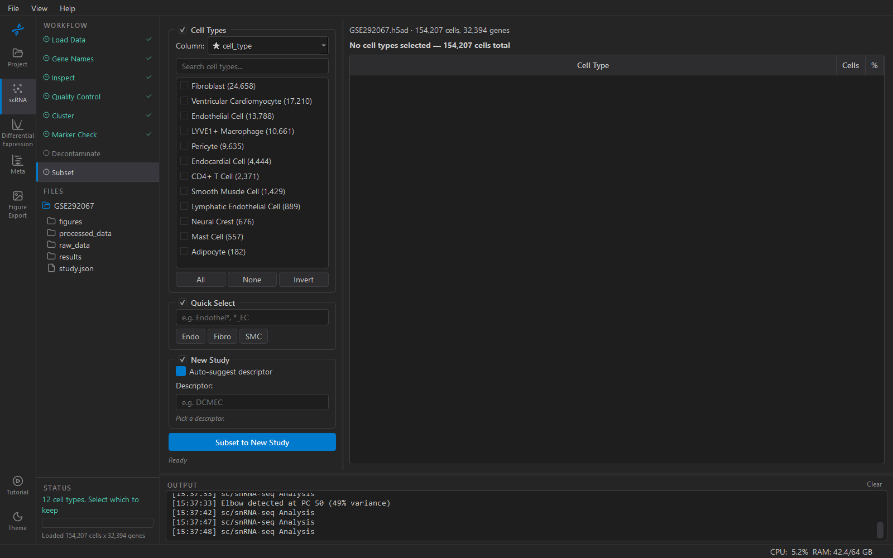

# Subset

Cuts the cells of one or more cell types out of this study and saves
them as a **new study** in the project. That new study is what
differential expression and the meta-analysis usually run on.

## Why a new study, not a filter

A per-cell-type meta-analysis needs, for each study, a DE result *for
that cell type*. Making the endothelial cells of `GSE183852` a study of
their own — `GSE183852_ECs` — gives them their own folder, their own
DE results and their own provenance, and lets the Project table show
their progress as a row. The parent study is untouched and can be
subset again for another cell type.

## Choosing cells

**Column** — the `obs` column holding the labels to select on. ★ marks
the columns KOSMIC recognises as cell-type labels: `cell_type` from
annotation, and `cell_type_atlas` if labels were propagated from a
shared atlas. Choosing between those two is choosing between the
study's own annotation and the atlas's; see
[Shared atlas](../project/atlas.md#independent-labels-vs-atlas-labels).

Tick the types to keep. **Search** accepts wildcards
(`*Endothelial*`); **All / None / Invert** do what they say. The panel
on the right shows how many cells you have selected out of how many.

## Naming the new study

The new folder is `<this study>_<descriptor>`. **Auto-suggest
descriptor** proposes one from the selected types (`ECs`, `CMs`); or
type your own — short, no spaces. The preview shows the full name.
Every study that goes into a meta-analysis of that cell type should
carry the same descriptor, because it is what you will be reading in
the forest plots and the results tables.

## What the subset contains

- The selected cells, and only genes that at least one of them
  expresses.
- The counts (`X`, `.raw`, `layers['counts']`) and, if you ran
  Decontaminate, `layers['decontX_counts']`.
- All `obs` metadata: sample, condition, roles, cell-type labels.
- **Not** the embeddings, neighbour graph or `leiden` clusters. Those
  were computed over the full dataset and would be wrong for this
  cell set, so they are cleared. Run **Cluster** on the new study if
  you want a UMAP of it — for DE you do not need to.

The subset's provenance points back at the parent's h5ad, so Methods
for the subset includes the parent's processing, and the Project page
shows it as *Subset of GSE183852*.

## Subset to New Study

Creates the folder, saves the h5ad, and switches the active study to
the new one — you land in it with the subset loaded. Go to
**Differential Expression** from there.

## Subsetting the shared atlas

Works the same way, and yields `_master_ECs`. That is a *combined* set
of endothelial cells from every study — useful for looking at them
together, but note that DE on it is a single pooled analysis with the
studies as a batch, which is the *mega*-analysis alternative to a
meta-analysis, not the same thing. The meta-analysis wants the
per-study subsets.
